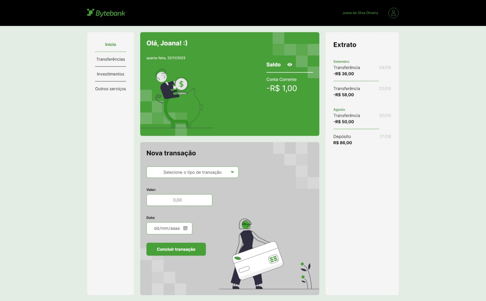

# ByteBank TS

>Satus: Ongoing

### Sistema de transações feito em JS com desenvolvimento em Typescript
> Parte 1

    Cada transação realizada no sistema deve possuir SOMENTE as seguintes informações:

1) Data da Transação (Date)
2) Tipo de Transação (Depósito, Transferência, Pagamento de Boleto)
3) Valor da Transação (valor maior que zero)

    - Sempre que a transação for do tipo DEPÓSITO, o valor da transação deve ser adicionado ao saldo da conta. 
    - Sempre que a transação for do tipo TRANSFERÊNCIA ou PAGAMENTO DE BOLETO, o valor da transação deve ser subtraído do saldo da conta. 
    - O saldo deve sempre ser atualizado na tela da aplicação a cada transação realizada.

>Parte 2 

    * As informações da conta devem ficar num módulo específico "Conta"
- Saldo
- Data de Acesso
- Registro de Transações realizadas
- Histórico de transações

* Os componentes
  - Nova transação: deve apenas coletar as informações do form da interface e repassar os dados para o módulo Conta 
  - Saldo: deve exibir as informações de data de acesso e do saldo para o usuário na interface acessando esses dados através do módulo Conta 

## Screenshots

1) Layout

## Tecnologias usadas:
<table style="text-align:center; display:flex; justify-content:center">
    <tr>
        <td>HTML</td>
        <td>CSS</td>
        <td>JavaScript</td>
        <td>TypeScript</td>
    </tr> 
    <tr>
        <td>5.0</td>
        <td>3.0</td>
        <td>*</td>
        <td>5.2.2</td>
    </tr>  
</table>

## Documentação da API

#### Retorna todos os itens

| Function    | Tipo       | Descrição                           |
| :---------- | :--------- | :---------------------------------- |
| `api_key`   | `string` | **Obrigatório**. A chave da sua API |

#### Retorna um item

| Function   | Tipo       | Descrição                                   |
| :----------| :--------- | :------------------------------------------ |
| `id`       | `string`   | **Obrigatório**. O ID do item que você quer |
 
#### add(num1, num2)